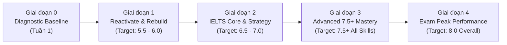

# 🎯 IELTS MASTER ROADMAP: B1 TO 8.0 OVERALL (ALL SKILLS ≥ 7.5)

> **Mục tiêu tối thượng**: Đạt **IELTS 8.0 Overall** với điểm sàn của từng kỹ năng:
> - 🎧 **Listening**: ≥ 8.5
> - 📖 **Reading**: ≥ 8.5
> - ✍️ **Writing**: ≥ 7.5
> - 🗣️ **Speaking**: ≥ 7.5
>
> **Chiến lược tiến độ**: Vượt mốc năng lực (Milestone-based) kết hợp chu kỳ Sprint linh hoạt theo tuần.

---

## 🧭 TỔNG QUAN HÀNH TRÌNH 4 GIAI ĐOẠN

---

## 📍 GIAI ĐOẠN 0: DIAGNOSTIC BASELINE (Tuần 1)
*Xác định chính xác tọa độ xuất phát, bóc tách lỗ hổng kiến thức sau thời gian dài không dùng.*

- **Mục tiêu**:
  - Đo lường mức độ rơi rụng ngữ pháp và từ vựng cốt lõi.
  - Đánh giá phản xạ đọc hiểu, nghe bắt từ khóa và phát hiện âm nối/nuốt âm.
  - Đo lường tư duy câu cú, mạch lạc trong viết và khả năng ứng biến trong nói.
- **Hành động cụ thể**:
  1. Hoàn thành đề thi tại `01_DIAGNOSTIC_SPRINT/DIAGNOSTIC_TEST.md`.
  2. Nộp kết quả để Mentor phân tích và phát hành `01_DIAGNOSTIC_SPRINT/DIAGNOSTIC_REPORT.md`.
  3. Tinh chỉnh trọng tâm phân bổ bài học cho Giai đoạn 1.

---

## 📍 GIAI ĐOẠN 1: FOUNDATION REACTIVATION & REBUILDING (Target: 5.5 - 6.0)
*Triệt tiêu lỗi sai ngữ pháp ngớ ngẩn (fossilized errors), kích hoạt lại phản xạ tự nhiên.*

- **Thời lượng ước tính**: 4 - 6 Sprints (tùy tiến độ thực tế).
- **Trọng tâm 4 Kỹ năng & Nền tảng**:
  - **Ngữ pháp chính xác (Grammar Precision)**:
    - Làm chủ 6 thì cốt lõi dùng nhiều nhất trong IELTS: Present Simple, Present Continuous, Present Perfect, Past Simple, Past Continuous, Future Forms.
    - Sửa triệt để lỗi Hòa hợp Chủ - Vị (Subject - Verb Agreement) và Mạo từ (*a/an/the*).
    - Cấu trúc câu ghép và câu phức căn bản: Adverbial clauses, Relative clauses (mệnh đề quan hệ xác định & không xác định).
  - **Phát âm & Nói (Pronunciation & Speaking Fluency)**:
    - Chuẩn hóa 44 âm trong bảng phiên âm quốc tế IPA (đặc biệt các cặp âm người Việt hay nhầm: /iː/ vs /ɪ/, /s/ vs /ʃ/, /θ/ vs /ð/, ending sounds /s/, /z/, /t/, /d/).
    - Kỹ thuật **Shadowing** 15 - 20 phút/ngày với nguồn nói chuẩn (BBC 6 Minute English, Spotlight English).
    - Phản xạ câu đơn & câu ghép ngắn với công thức **A-R-E-A** căn bản.
  - **Đọc & Nghe (Receptive Reflex)**:
    - *Listening*: Nghe bắt âm cơ bản, rèn luyện chính tả từ vựng (Spelling, số, ngày tháng, tên riêng) qua Cambridge Listening Part 1.
    - *Reading*: Xây dựng thói quen đọc 1 bài báo/ngày (BBC News, The Guardian - Lifestyle/Culture); kỹ thuật phân tích kết cấu câu dài (Cụm danh từ phức, mệnh đề quan hệ).
  - **Viết căn bản (Writing Fundamentals)**:
    - Cấu trúc đoạn văn học thuật chuẩn **PEEL** (*Point - Explanation - Example - Link*).
    - Viết các đoạn văn 80 - 100 từ mạch lạc, không sai ngữ pháp câu đơn và câu phức.
- **Tiêu chí nghiệm thu (Exit Criteria)**: Xem chi tiết tại `00_ROADMAP_AND_TRACKING/MILESTONE_CRITERIA.md`.

---

## 📍 GIAI ĐOẠN 2: CORE IELTS STRATEGY & SKILL SHAPING (Target: 6.5 - 7.0)
*Làm chủ toàn bộ dạng bài thi; đẩy mạnh Listening & Reading lên vùng an toàn 7.5+.*

- **Thời lượng ước tính**: 6 - 8 Sprints.
- **Trọng tâm 4 Kỹ năng**:
  - **Listening (Target: 7.5+)**:
    - Chinh phục Part 2 (Bản đồ, Quy trình) và Part 3 (Hội thoại học thuật nhiều người nói).
    - Nắm vững kỹ thuật bóc tách bẫy (*Distractor Analysis*), bẫy chuyển hướng ý (*However, Actually, In fact*).
  - **Reading (Target: 7.5+)**:
    - Kỹ thuật Skimming (Đọc lướt lấy ý chính) và Scanning (Đọc quét tìm dữ liệu) tốc độ cao.
    - Giải quyết dứt điểm các dạng bài khó: True/False/Not Given, Matching Headings, Which Paragraph Contains Information.
    - Xây dựng bảng từ khóa Paraphrase (Keyword Table) sau mỗi bài làm.
  - **Writing Lab (Target: 6.5 - 7.0)**:
    - *Task 1*: Phân tích biểu đồ động (Dynamic charts), biểu đồ tĩnh (Static charts), bản đồ (Maps) và quy trình (Processes). Kỹ năng chọn lọc số liệu tiêu biểu (Key Features) và viết câu Overview chuẩn xác.
    - *Task 2*: Bố cục 4 đoạn chuẩn mực cho 4 dạng bài: Agree/Disagree, Discuss Both Views, Problems & Solutions, Two-Part Questions. Rèn luyện tư duy lập luận nhiều tầng.
  - **Speaking Club (Target: 6.5 - 7.0)**:
    - *Part 1*: Trả lời tự nhiên trong 3 - 4 câu, sử dụng từ vựng đa dạng, giảm thiểu "uhm/ah".
    - *Part 2*: Kỹ thuật lập dàn ý trong 1 phút bằng Mindmap; vận dụng công thức Past - Present - Future để đảm bảo thời lượng nói tròn 2 phút.
    - *Part 3*: Mở rộng luận điểm theo góc nhìn xã hội, sử dụng các liên từ học thuật và từ chỉ mức độ (*tend to, largely attributed to*).

---

## 📍 GIAI ĐOẠN 3: ADVANCED 7.5+ MASTERY & NUANCE UPGRADING (Target: 7.5+ All Skills)
*Gọt dũa tư duy bản xứ, loại bỏ lối hành văn dịch cơ học, đột phá rào cản 7.5 Writing & Speaking.*

- **Thời lượng ước tính**: 6 - 10 Sprints.
- **Trọng tâm Chuyên sâu**:
  - **Writing 7.5+ Masterclass**:
    - *Task Response (TR 8)*: Luận điểm sâu sắc, phát triển ý tưởng đến cùng; đưa ra phản biện (*Counter-argument & Refutation*), tránh suy luận nông cạn.
    - *Coherence & Cohesion (CC 8)*: Liên kết hữu cơ thông qua đại từ thay thế (Pronoun referencing), trường từ vựng (Lexical chaining) thay vì lạm dụng liên từ nối ở đầu câu (*Furthermore, Moreover*).
    - *Lexical Resource (LR 8)*: Sử dụng linh hoạt Collocations học thuật tự nhiên (không học từ đơn lẻ); loại bỏ văn phong thuần Việt dịch sang tiếng Anh.
    - *Grammar (GRA 8)*: Kiểm soát tuyệt đối các cấu trúc cao cấp: Đảo ngữ (Inversion), Câu chẻ (Cleft sentences), Phân từ hoàn thành (Having + V3), Mệnh đề nhượng bộ (*Notwithstanding the fact that...*).
  - **Speaking 7.5+ Masterclass**:
    - Nhuần nhuyễn ngữ điệu cảm xúc, nhấn trọng âm câu (Sentence Stress) để làm nổi bật thông điệp.
    - Sử dụng các Discourse Markers tự nhiên của người bản xứ (*To be quite honest, It goes without saying, Having considered both angles*).
    - Xử lý mượt mà các chủ đề trừu tượng: Triết học, Đạo đức công nghệ, Toàn cầu hóa, Bảo tồn văn hóa.
  - **Listening & Reading 8.5+ Precision**:
    - Rèn luyện phản xạ làm Reading trong 50 phút (dành 10 phút kiểm tra).
    - Bắt trọn vẹn tín hiệu âm thanh và từ vựng chuyển hướng trong Section 4 Listening.

---

## 📍 GIAI ĐOẠN 4: EXAM SIMULATION & PEAK PERFORMANCE (Target: 8.0 Overall)
*Rèn luyện áp lực phòng thi, tối ưu hóa điểm rơi phong độ.*

- **Nội dung chính**:
  1. Giải trọn bộ Cambridge IELTS mới nhất (Cam 17 - 19) dưới điều kiện áp lực thời gian chuẩn thi thật.
  2. Thi thử Mock Test 4 kỹ năng trong một buổi sáng/chiều.
  3. Soát lỗi chi tiết lần cuối với `06_ERROR_LOG`.
  4. Chiến lược dinh dưỡng, giấc ngủ và tinh thần trước ngày thi.

---

## 📚 TỦ SÁCH & NGUỒN HỌC CHUẨN ĐƯỢC CHỌN LỌC

1. **Ngữ pháp & Từ vựng**:
   - *English Grammar in Use* (Raymond Murphy) & *Advanced Grammar in Use* (Martin Hewings).
   - *Cambridge Vocabulary for IELTS Advanced* (Pauline Cullen).
   - *Oxford Collocations Dictionary*.
2. **Kỹ năng Tiếp nhận (Listening & Reading)**:
   - Bộ đề *Cambridge IELTS Academic* (Từ Cam 12 đến Cam 19).
   - Báo chí học thuật: *The Economist*, *National Geographic*, *The Guardian*, *Scientific American*.
   - Kênh nghe: *TED Talks*, *BBC Radio 4 - In Our Time*, *The Daily (The New York Times)*.
3. **Kỹ năng Sản sinh (Writing & Speaking)**:
   - *IELTS Advantage: Writing Skills* (Richard Brown & Lewis Richards).
   - *The Key to IELTS Success* (Pauline Cullen).
   - Toàn bộ tài liệu phân tích và bài mẫu được Mentor cung cấp trực tiếp trong `03_WRITING_LAB` và `04_SPEAKING_CLUB`.
